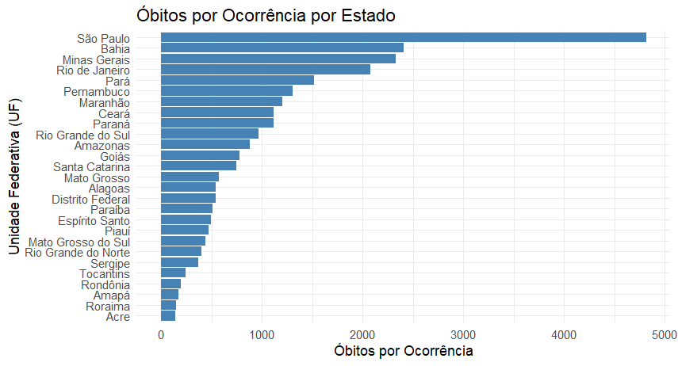
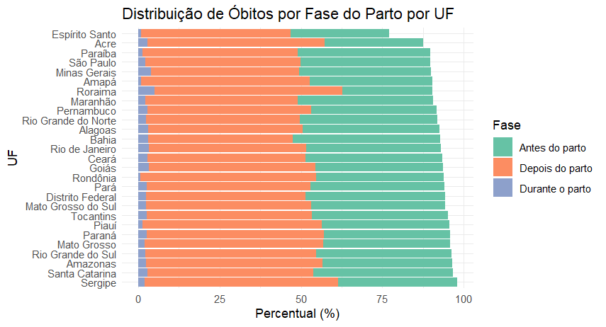

DEB3102 - ANÁLISE DE DADOS EM SAÚDE

Aluna: Rafaela Ribeiro Marques dos Santos

## Por que esse tema é relevante?

Do ponto de vista social:

##👩‍👧‍👦 1. Invisibilidade de mulheres e bebês em situação de vulnerabilidade

Se os dados sobre a mãe não são registrados adequadamente, essas gestantes — muitas vezes pobres, negras, indígenas ou com baixa escolaridade — se tornam estatisticamente invisíveis.

❗ O que não é registrado, não é visto — e o que não é visto, não é prioridade.

<br>

## 🏥 2. Reflete desigualdades no acesso ao sistema de saúde
Campos mal preenchidos muitas vezes acontecem:

- Em áreas com menor infraestrutura de saúde;

- Onde há sobrecarga de profissionais;

- Em locais onde as gestantes não têm acompanhamento adequado.

Isso evidencia desigualdades regionais e sociais no cuidado pré-natal e na atenção ao parto.

<br>

## ⚖️ 3. Impacto na formulação de políticas públicas justas
Sem dados completos, o Estado não consegue entender o perfil das mulheres que perdem seus bebês — o que impede:

- A criação de políticas de prevenção do óbito fetal;

- Ações específicas para proteger mães em risco;

- O monitoramento da efetividade das políticas existentes.

<br>

## Do ponto de vista técnico
<br>

## 🔍 1. Qualidade dos dados

A completitude (ou preenchimento adequado) dos campos é um dos principais indicadores de qualidade da base de dados. Em análises exploratórias, isso é essencial porque:

- Dados faltantes limitam a análise estatística e a construção de modelos preditivos.

- Permite avaliar se há viés sistemático (por exemplo: certos grupos têm mais dados incompletos?).

- Completitude ruim pode indicar fragilidade no sistema de registro, especialmente em regiões vulneráveis.

<br>
```

## Agora... vamos aos dados!

<br>






