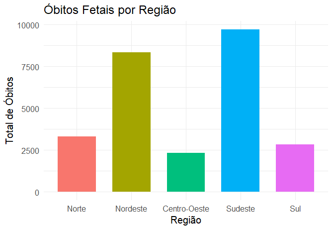
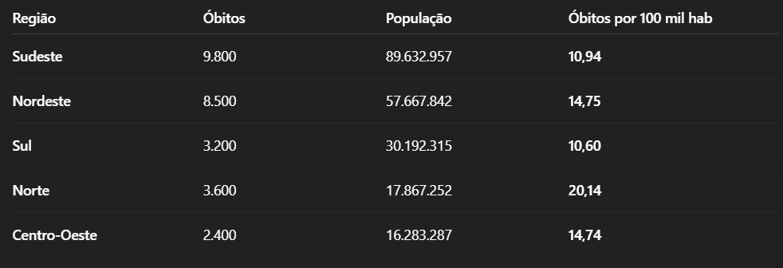
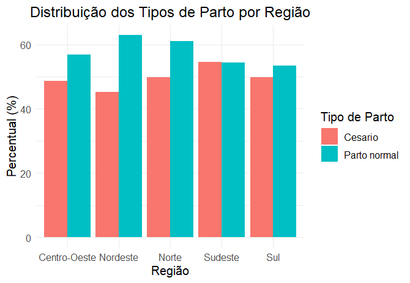
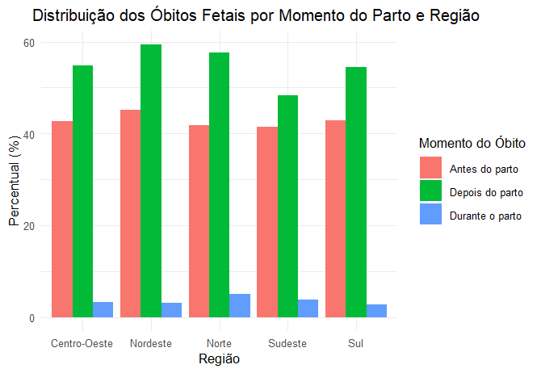
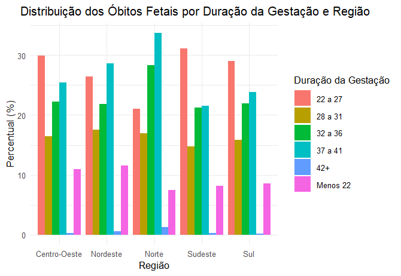
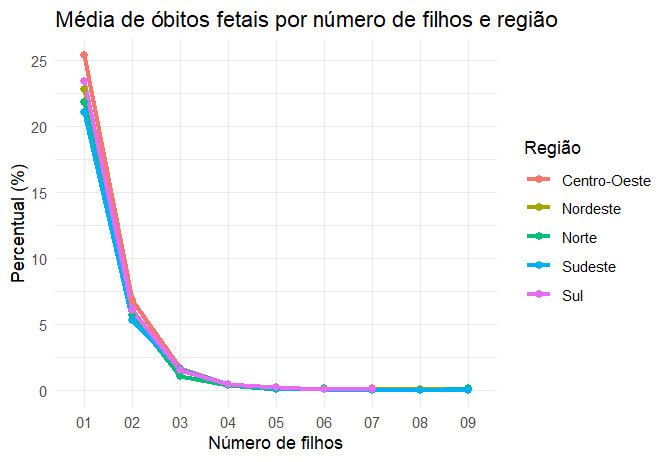

DEB3102 - ANÁLISE DE DADOS EM SAÚDE

Aluna: Rafaela Ribeiro Marques dos Santos

## Por que esse tema é relevante?

Do ponto de vista social:

## 👩‍👧‍👦 1. Invisibilidade de mulheres e bebês em situação de vulnerabilidade

Se os dados sobre a mãe não são registrados adequadamente, essas gestantes se tornam estatisticamente invisíveis.

❗ O que não é registrado, não é visto — e o que não é visto, não é prioridade.

<br>

## 🏥 2. Reflete desigualdades no acesso ao sistema de saúde
Campos mal preenchidos muitas vezes acontecem:

- Em áreas com menor infraestrutura de saúde;

- Onde há sobrecarga de profissionais;

- Em locais onde as gestantes não têm acompanhamento adequado.

Isso evidencia desigualdades regionais e sociais no cuidado pré-natal e na atenção ao parto.

<br>

## ⚖️ 3. Impacto na formulação de políticas públicas justas
Sem dados completos, o Estado não consegue entender o perfil das mulheres que perdem seus bebês — o que impede:

- A criação de políticas de prevenção do óbito fetal;

- Ações específicas para proteger mães em risco;

- O monitoramento da efetividade das políticas existentes.

<br>

## Do ponto de vista técnico
<br>

## 🔍 1. Qualidade dos dados

A completitude (ou preenchimento adequado) dos campos é um dos principais indicadores de qualidade da base de dados. Em análises exploratórias, isso é essencial porque:

- Dados faltantes limitam a análise estatística e a construção de modelos preditivos.

- Permite avaliar se há viés sistemático (por exemplo: certos grupos têm mais dados incompletos?).

- Completitude ruim pode indicar fragilidade no sistema de registro, especialmente em regiões vulneráveis.

<br>
```

## Agora... vamos aos dados!

<br>

## Quais estados tiveram dados mais expressivos?


<br>

| Estado         | População (2023) |
|----------------|------------------|
| São Paulo      | 45.973.194       |
| Rio de Janeiro | 21.322.691       |
| Bahia          | 17.219.679       |
| Minas Gerais   | 14.850.513       |

<br>

## Agrupando dados por região

<br>



<br>



<br>

## 🔍 Observações:

- A região Norte apresenta a maior taxa proporcional (20,14).

- O Sudeste, apesar de ter o maior número absoluto de óbitos, tem uma taxa proporcional menor que a média.

- Esse tipo de ajuste populacional é crucial para análises justas entre regiões.

<br>

## Qual tipo de parto teve mais óbitos?

<br>


<br>

## Os óbitos ocorreram em qual momento?

<br>


<br>

## Em qual semana a gestação estava?

<br>



<br>

## Essas mulheres possuem o mesmo histórico em gestações passadas?

<br>



## Análise dos dados

* Maior número de óbitos informados:
A região Norte, juntamente com a Nordeste, apresenta maior número de óbitos fetais informados no Sistema de Informação sobre Mortalidade (SIM), em comparação com as regiões mais desenvolvidas. 

* Desigualdades regionais:
As diferenças regionais na enumeração dos registros de óbitos fetais refletem desigualdades socioeconômicas e de acesso à saúde.

* Fatores de risco:
As principais causas de óbitos fetais incluem hipertensão arterial, infecções, problemas placentários, e questões genéticas e/ou anatômicas. 

* Investigações:
A investigação dos óbitos infantis e fetais ainda é baixa, o que dificulta a identificação de fatores de risco e a implementação de medidas de prevenção. 

<br>  
